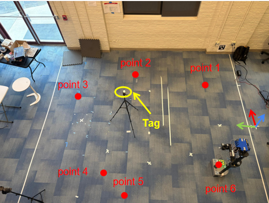

# BLE Angle-of-Arrival Navigation System

We built a BLE Angle-of-Arrival (AoA) localization pipeline that extends an existing WiFi-based robot navigation system running on a Hello Robot Stretch SE3. Using the u-blox XPLR-AOA-3 kit — an 8-element patch antenna array paired with a C209 BLE tag — the system measures the direction of incoming BLE signals to estimate tag position. Unlike vision-only approaches, BLE signals enable instance-level identification via MAC address and can localize targets even when they are not visually observable. We developed a custom ROS2 node that reads AoA data from the antenna board over USB and publishes azimuth and elevation measurements to the `/aoa/measurement` topic at 20 Hz, making the BLE signal stream immediately available to the robot's navigation stack. Using least-squares ray intersection across 6 anchor positions, we achieved a localization error of **10.1 cm under line-of-sight** and **32.6 cm under NLOS** (tag and robot separated by a wall), demonstrating that BLE AoA is a practical complement to WiFi sensing for indoor robot navigation.

